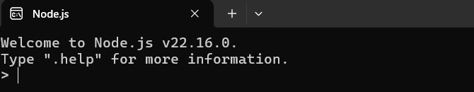
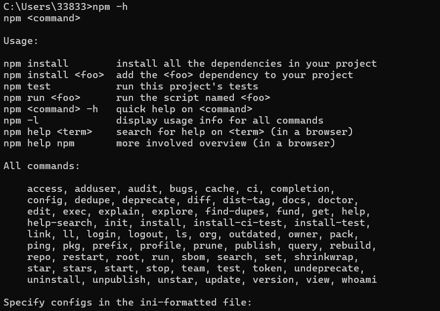

# Сайт с счетчиком

## О проекте

Данный проект представляет собой веб-сайт написанный на фреймворке языка программирования JavaScript под названием React. Сам веб-сайт представляет счетчик, с возможностью отнимать и добавлять единицу от значения.


## Установка

Чтобы установить данный репозиторий выполните в вашем терминале следующую команду
```bash
git clone https://github.com/Nick536363/React_lesson1
```

Если же у вас не установлена утилита *git* тогда вы можете скачать проект прямо с сервиса *GitHub*, либо же скачать git с [этого сайта](https://git-scm.com/downloads)


Перед тем как использовать данный проект вам следует установить **Node.js** и **NPM**, если вы еще этого не сделали.
Ниже будут приведены способы установки на системах *Linux* и *Windows*

> ### Linux
> Откройте свой терминал и введите следующие команды:
```bash
sudo apt install npm
sudo apt install nodejs
```

>Либо же

```bash
sudo apt install npm nodejs
```

> ### Windows
>Для того чтобы установить Node.js вместе с NPM посетите [этот сайт](https://nodejs.org/)

### Проверка рабоспособности

Для того чтобы проверить работоспособность установленных вышепреведенных зависимостей, выполните следующие действия:

- Зайдите в терминал и выполните следующую команду
```bash
node
```
Если вы увидели похожее приглашение как на изображении снизу, значит вы всё выполнили правильно


- Следом, в вашем терминале выполните вторую команду
```bash
npm -h
```

Если вам в терминал вывелся список комманд для NPM - вы всё сделали правильно и зависимость установлена успешно!



## Запуск веб-сайта

Чтобы запустить веб-сайт, в терминале перейдите в коренной каталог проекта и выполните следующую команду

```bash
npm start
```

После чего у вас должна будет открыться вкладка с сайтом. Если же этого не произошло перейдите по [этой ссылке](http://localhost:3000) либо впишите в адресной строке вашего браузера *http://localhost:3000/*

Если вы сделали всё правильно то содержимое страницы должно соответсвовать изображению ниже
